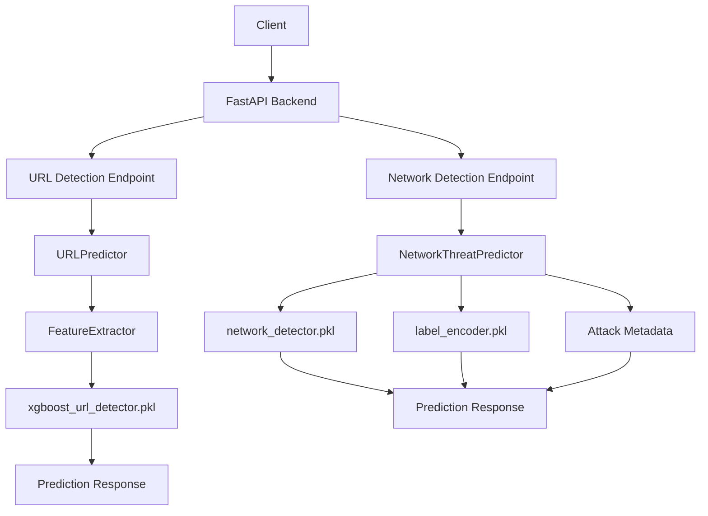
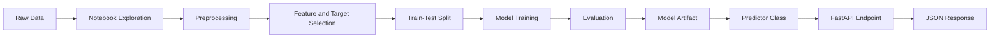
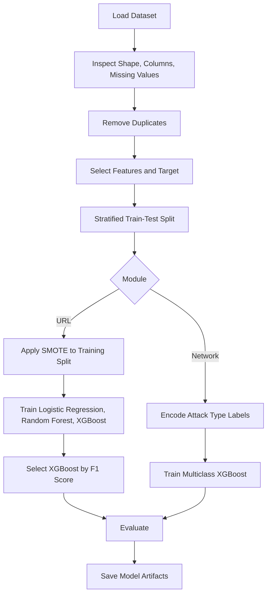
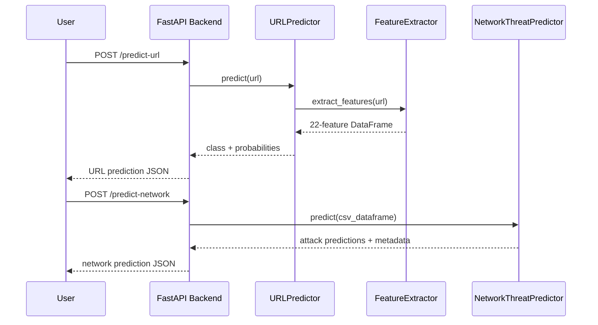

# CyberShield-AI

<p align="center">
  <strong>AI-powered cybersecurity threat detection system for phishing URL classification and network intrusion detection.</strong>
</p>

<p align="center">
  <a href="#api-documentation">API</a> |
  <a href="#machine-learning-pipeline">ML Pipeline</a> |
  <a href="#dataset">Datasets</a> |
  <a href="#running-locally">Run Locally</a>
</p>

---

## Hero Banner

```text
  ______      __               _____ __    _      __    __
 / ____/_  __/ /_  ___  _____ / ___// /_  (_)__  / /___/ /
/ /   / / / / __ \/ _ \/ ___/ \__ \/ __ \/ / _ \/ / __  /
/ /___/ /_/ / /_/ /  __/ /    ___/ / / / / /  __/ / /_/ /
\____/\__, /_.___/\___/_/    /____/_/ /_/_/\___/_/\__,_/
     /____/

 CyberShield-AI
 URL Phishing Detection + Network Threat Classification
```

CyberShield-AI is a machine learning cybersecurity project that combines:

- A URL phishing detector trained on lexical and structural URL features.
- A network intrusion detector trained on CICIDS2017-style network flow features.
- A FastAPI backend that exposes both models through HTTP endpoints.
- Saved model artifacts for direct inference through Python classes.

---

## Project Description

CyberShield-AI is designed to classify suspicious cybersecurity inputs using supervised machine learning.

The project currently contains two detection modules:

1. **URL Detection**

   The URL detection module analyzes a URL string, extracts 22 numeric features, and predicts whether the URL is legitimate or phishing.

2. **Network Detection**

   The network detection module analyzes tabular network flow data and predicts one of seven traffic or attack classes.

The backend loads both trained models at application startup and serves predictions through FastAPI.

---

## Badges


---

## Table of Contents

- [Hero Banner](#hero-banner)
- [Project Description](#project-description)
- [Badges](#badges)
- [Table of Contents](#table-of-contents)
- [Problem Statement](#problem-statement)
- [Motivation](#motivation)
- [Solution Overview](#solution-overview)
- [Features](#features)
- [Project Architecture](#project-architecture)
- [Workflow Diagram](#workflow-diagram)
- [Machine Learning Pipeline](#machine-learning-pipeline)
- [System Pipeline](#system-pipeline)
- [Technology Stack](#technology-stack)
- [Folder Structure](#folder-structure)
- [Dataset](#dataset)
- [Feature Engineering](#feature-engineering)
- [Model Training](#model-training)
- [Model Evaluation](#model-evaluation)
- [Results](#results)
- [API Documentation](#api-documentation)
- [Installation](#installation)
- [Running Locally](#running-locally)
- [Running Backend](#running-backend)
- [Running Frontend](#running-frontend)
- [Usage Examples](#usage-examples)
- [Screenshots](#screenshots)
- [Performance](#performance)
- [Future Enhancements](#future-enhancements)
- [Contributors](#contributors)
- [Author](#author)
- [License](#license)
- [Acknowledgements](#acknowledgements)

---

## Problem Statement

Cybersecurity teams must identify malicious activity from heterogeneous inputs such as URLs and network flow records.

This repository addresses two detection problems:

- **Phishing URL detection:** classify URLs as legitimate or phishing from extracted lexical, structural, domain, path, query, and entropy-based features.
- **Network intrusion detection:** classify network flow records into normal traffic or known attack categories using numerical traffic-flow features.

The repository implements model training notebooks, reusable prediction classes, saved model artifacts, and an API layer for inference.

---

## Motivation

Phishing URLs and malicious network traffic remain common entry points for cyberattacks.

CyberShield-AI exists to provide a practical machine learning workflow for:

- Training cybersecurity classifiers from structured datasets.
- Serving trained models through a backend API.
- Comparing URL and network-level signals in one repository.
- Demonstrating an end-to-end path from dataset exploration to inference.

The implementation is useful for portfolio review, technical interviews, ML engineering discussion, and future open source extension.

---

## Solution Overview

CyberShield-AI uses supervised classification models.

For URL detection:

- Raw URL records are loaded from `url_detection/datasets/raw/Dataset___URL!.csv`.
- Duplicate rows are removed during notebook training.
- Non-model columns are removed.
- Training data is stratified into train and test splits.
- SMOTE is applied to the training split.
- Logistic Regression, Random Forest, and XGBoost are compared.
- XGBoost is selected as the final model in the notebook.
- The saved model is loaded by `URLPredictor`.

For network detection:

- Network flow records are loaded from `network_detection/datasets/raw/cicids2017_cleaned.csv`.
- The target column is `Attack Type`.
- Labels are encoded with `LabelEncoder`.
- A stratified train-test split is used.
- XGBoost is trained as a multiclass classifier.
- The trained model and label encoder are saved as pickle artifacts.
- `NetworkThreatPredictor` loads both artifacts and returns predictions with confidence and attack metadata.

For API inference:

- FastAPI loads both predictors at startup.
- `/predict-url` accepts a URL JSON payload.
- `/predict-network` accepts a CSV upload.
- Responses are returned as JSON.

---

## Features

- Binary URL phishing classification.
- Multiclass network intrusion classification.
- FastAPI backend with CORS configuration.
- URL feature extraction implemented in reusable Python code.
- Offline domain and suffix handling for URL inference.
- Saved model loading through `joblib`.
- Network prediction metadata with risk level, description, and recommendation.
- Notebook-based model training and evaluation.
- CSV upload workflow for batch network predictions.
- Clear separation between backend, URL detection, and network detection modules.

Implemented but limited:

- `network_detection/feature_engineering.py` contains a Scapy-based packet capture class.
- Several `src` files are present as placeholders or empty modules.
- The `frontend`, `assets`, and `docs` directories currently exist but contain no implementation files.
- The `reports` directory currently contains only `.gitkeep`.

---

## Project Architecture



The backend is located in `backend/main.py`.

At import time, it:

- Computes the repository root.
- Adds `url_detection/src` and `network_detection` to `sys.path`.
- Imports `URLPredictor`.
- Imports `NetworkThreatPredictor`.
- Instantiates both predictors.
- Raises a runtime error if model loading fails.

---

## Workflow Diagram



---

## Machine Learning Pipeline



---

## System Pipeline



---

## Technology Stack

### Core Language

- Python

### API

- FastAPI
- Uvicorn
- Pydantic
- CORS middleware

### Data Science and Machine Learning

- NumPy
- Pandas
- scikit-learn
- XGBoost
- imbalanced-learn SMOTE
- joblib

### Visualization and Notebooks

- Jupyter notebooks
- Matplotlib
- Seaborn

### Network Tooling

- Scapy is imported by `network_detection/feature_engineering.py` for packet capture.

### Dependency Notes

The current `requirements.txt` lists:

```text
numpy
pandas
scikit-learn
matplotlib
seaborn
tensorflow
keras
flask
fastapi
uvicorn
joblib
python-dotenv
```

The notebooks and source code also import packages that are not currently listed in `requirements.txt`:

```text
xgboost
imblearn
scapy
```

---

## Folder Structure

```text
CyberShield-AI/
├── .gitignore
├── README.md
├── requirements.txt
├── assets/
├── backend/
│   └── main.py
├── docs/
├── frontend/
├── models/
│   └── .gitkeep
├── network_detection/
│   ├── __init__.py
│   ├── feature_engineering.py
│   ├── network_attack_metadata.py
│   ├── network_predictor.py
│   ├── test_predictor.ipynb
│   ├── datasets/
│   │   ├── processed/
│   │   │   └── .gitkeep
│   │   └── raw/
│   │       ├── .gitkeep
│   │       └── cicids2017_cleaned.csv
│   ├── models/
│   │   ├── label_encoder.pkl
│   │   └── network_detector.pkl
│   ├── notebooks/
│   │   ├── EDA.ipynb
│   │   └── Model_Training.ipynb
│   └── src/
│       ├── __init__.py
│       ├── evaluate.py
│       ├── predict.py
│       ├── preprocessing.py
│       ├── train.py
│       └── utils.py
├── reports/
│   └── .gitkeep
└── url_detection/
    ├── __init__.py
    ├── datasets/
    │   ├── processed/
    │   │   └── .gitkeep
    │   └── raw/
    │       ├── .gitkeep
    │       └── Dataset___URL!.csv
    ├── models/
    │   └── xgboost_url_detector.pkl
    ├── notebooks/
    │   ├── Model_Training.ipynb
    │   └── feature_testing.ipynb
    └── src/
        ├── __init__.py
        ├── evaluate.py
        ├── feature_engineering.py
        ├── predictor.py
        ├── preprocessing.py
        ├── train.py
        └── utils.py
```

### Important Directories

| Path | Purpose |
| --- | --- |
| `backend/` | FastAPI application and API endpoint definitions. |
| `url_detection/` | URL phishing detection dataset, notebook, model artifact, feature extraction, and predictor code. |
| `network_detection/` | Network intrusion dataset, notebook, model artifacts, attack metadata, and predictor code. |
| `frontend/` | Frontend directory placeholder. No frontend implementation files are currently present. |
| `assets/` | Static asset directory placeholder. No files are currently present. |
| `docs/` | Documentation directory placeholder. No files are currently present. |
| `reports/` | Report artifact directory placeholder. No evaluation report files are currently present. |
| `models/` | Top-level model directory placeholder. Active model artifacts are stored inside module-specific `models/` directories. |

---

## Dataset

### URL Dataset

| Property | Value |
| --- | --- |
| File | `url_detection/datasets/raw/Dataset___URL!.csv` |
| Raw rows | 116,600 |
| Raw columns | 26 |
| Rows after duplicate removal in notebook | 115,231 |
| Duplicate rows reported in notebook | 1,369 |
| Target column | `label` |
| Number of classes | 2 |
| Class `0` raw count | 100,000 |
| Class `1` raw count | 16,600 |
| Class `0` count after duplicate removal | 98,641 |
| Class `1` count after duplicate removal | 16,590 |
| Missing values reported | `tld`: 14 missing values |

The notebook uses `label` as the target.

The API maps:

- `0` to `Legitimate`
- `1` to `Phishing`

### URL Dataset Columns

```text
url
url_len
dom
dom_len
is_ip
tld
tld_len
subdom_cnt
letter_cnt
digit_cnt
special_cnt
eq_cnt
qm_cnt
amp_cnt
dot_cnt
dash_cnt
under_cnt
letter_ratio
digit_ratio
spec_ratio
is_https
slash_cnt
entropy
path_len
query_len
label
```

### URL Model Features

The notebook drops `url`, `dom`, `tld`, and `label`.

The final URL model uses 22 numeric features:

```text
url_len
dom_len
is_ip
tld_len
subdom_cnt
letter_cnt
digit_cnt
special_cnt
eq_cnt
qm_cnt
amp_cnt
dot_cnt
dash_cnt
under_cnt
letter_ratio
digit_ratio
spec_ratio
is_https
slash_cnt
entropy
path_len
query_len
```

### Network Dataset

| Property | Value |
| --- | --- |
| File | `network_detection/datasets/raw/cicids2017_cleaned.csv` |
| Rows | 2,520,751 |
| Columns | 53 |
| Feature columns | 52 |
| Target column | `Attack Type` |
| Number of classes | 7 |

### Network Class Distribution

| Attack Type | Count |
| --- | ---: |
| Normal Traffic | 2,095,057 |
| DoS | 193,745 |
| DDoS | 128,014 |
| Port Scanning | 90,694 |
| Brute Force | 9,150 |
| Web Attacks | 2,143 |
| Bots | 1,948 |

### Network Dataset Columns

```text
Destination Port
Flow Duration
Total Fwd Packets
Total Length of Fwd Packets
Fwd Packet Length Max
Fwd Packet Length Min
Fwd Packet Length Mean
Fwd Packet Length Std
Bwd Packet Length Max
Bwd Packet Length Min
Bwd Packet Length Mean
Bwd Packet Length Std
Flow Bytes/s
Flow Packets/s
Flow IAT Mean
Flow IAT Std
Flow IAT Max
Flow IAT Min
Fwd IAT Total
Fwd IAT Mean
Fwd IAT Std
Fwd IAT Max
Fwd IAT Min
Bwd IAT Total
Bwd IAT Mean
Bwd IAT Std
Bwd IAT Max
Bwd IAT Min
Fwd Header Length
Bwd Header Length
Fwd Packets/s
Bwd Packets/s
Min Packet Length
Max Packet Length
Packet Length Mean
Packet Length Std
Packet Length Variance
FIN Flag Count
PSH Flag Count
ACK Flag Count
Average Packet Size
Subflow Fwd Bytes
Init_Win_bytes_forward
Init_Win_bytes_backward
act_data_pkt_fwd
min_seg_size_forward
Active Mean
Active Max
Active Min
Idle Mean
Idle Max
Idle Min
Attack Type
```

---

## Feature Engineering

### URL Feature Engineering

URL feature extraction is implemented in:

```text
url_detection/src/feature_engineering.py
```

The main class is:

```python
FeatureExtractor
```

The public method is:

```python
extract_features(url: str) -> pandas.DataFrame
```

The extractor returns a one-row DataFrame with the same 22 feature columns used during training.

Implemented URL feature groups:

- URL length metrics.
- Domain length metrics.
- IP-address detection.
- Public suffix / TLD length.
- Subdomain count.
- Letter, digit, and special character counts.
- Character-specific counts for `=`, `?`, `&`, `.`, `-`, and `_`.
- Letter, digit, and special-character ratios.
- HTTPS scheme indicator.
- Slash count.
- Shannon entropy.
- URL path length.
- Query string length.

The extractor uses:

- `urllib.parse.urlparse` for parsing.
- `ipaddress` for IPv4 and IPv6 address detection.
- An offline fallback suffix list.
- Additional suffixes loaded from the bundled URL training CSV when available.

Design detail from the code:

- Feature counting is performed on the stripped original URL text.
- Scheme-less hostnames are handled by attempting a network-path parse.
- DNS, WHOIS, and external APIs are not used during feature extraction.

### Network Feature Engineering

The network training notebook uses precomputed numeric network flow columns from `cicids2017_cleaned.csv`.

The active prediction class expects a `pandas.DataFrame` containing the same network feature columns used by the trained model.

`network_detection/feature_engineering.py` contains:

```python
PacketCapture
```

with:

```python
capture_packets(count=10)
```

This class uses `scapy.all.sniff` to capture live packets.

The repository does not currently include code that converts captured Scapy packets into the 52 model-ready CICIDS2017-style flow features.

---

## Model Training

### URL Model Training

Notebook:

```text
url_detection/notebooks/Model_Training.ipynb
```

Training workflow extracted from the notebook:

1. Import data science and machine learning libraries.
2. Load `Dataset___URL!.csv`.
3. Inspect dataset shape, columns, dtypes, and missing values.
4. Detect duplicate rows.
5. Drop duplicate rows.
6. Drop non-feature columns: `url`, `dom`, `tld`, and `label`.
7. Use `label` as the target.
8. Create a stratified train-test split.
9. Apply SMOTE to the training split.
10. Train and compare Logistic Regression, Random Forest, and XGBoost.
11. Select XGBoost as `best_model`.
12. Evaluate the selected model.
13. Save the trained model.

URL split configuration:

| Parameter | Value |
| --- | --- |
| Test size | `0.20` |
| Random state | `42` |
| Stratify | `y` |

URL SMOTE configuration:

| Parameter | Value |
| --- | --- |
| Random state | `42` |

URL training samples:

| Stage | Shape / Count |
| --- | --- |
| Features after duplicate removal | `(115231, 22)` |
| Target after duplicate removal | `(115231,)` |
| Training split | `(92184, 22)` |
| Test split | `(23047, 22)` |
| Training samples after SMOTE | `(157824, 22)` |

URL model candidates:

| Model | Configuration from notebook |
| --- | --- |
| Logistic Regression | `max_iter=1000`, `random_state=42` |
| Random Forest | `n_estimators=300`, `random_state=42`, `n_jobs=-1` |
| XGBoost | `objective="binary:logistic"`, `eval_metric="logloss"`, `random_state=42`, `n_estimators=300`, `tree_method="hist"`, `n_jobs=-1` |

URL saved artifact:

```text
url_detection/models/xgboost_url_detector.pkl
```

### Network Model Training

Notebook:

```text
network_detection/notebooks/Model_Training.ipynb
```

Training workflow extracted from the notebook:

1. Load `cicids2017_cleaned.csv`.
2. Inspect dataset shape, columns, dtypes, and class distribution.
3. Drop `Attack Type` to create the feature matrix.
4. Encode `Attack Type` with `LabelEncoder`.
5. Create a stratified train-test split.
6. Train an XGBoost multiclass classifier.
7. Evaluate accuracy, classification report, and confusion matrix.
8. Save the model and label encoder.

Network split configuration:

| Parameter | Value |
| --- | --- |
| Test size | `0.2` |
| Random state | `42` |
| Stratify | `y` |

Network training samples:

| Stage | Shape |
| --- | --- |
| Features | `(2520751, 52)` |
| Target | `(2520751,)` |
| Training split | `(2016600, 52)` |
| Test split | `(504151, 52)` |

Network label mapping:

| Class | Encoded Value |
| --- | ---: |
| Bots | 0 |
| Brute Force | 1 |
| DDoS | 2 |
| DoS | 3 |
| Normal Traffic | 4 |
| Port Scanning | 5 |
| Web Attacks | 6 |

Network XGBoost configuration:

```python
XGBClassifier(
    objective="multi:softprob",
    num_class=7,
    n_estimators=200,
    max_depth=8,
    learning_rate=0.1,
    subsample=0.8,
    colsample_bytree=0.8,
    tree_method="hist",
    random_state=42,
    n_jobs=-1,
    eval_metric="mlogloss",
)
```

Network training time reported by the notebook:

```text
7.26 minutes
```

Network saved artifacts:

```text
network_detection/models/network_detector.pkl
network_detection/models/label_encoder.pkl
```

---

## Model Evaluation

### URL Evaluation

The URL notebook compares three models.

| Model | Accuracy | Precision | Recall | F1 Score | ROC-AUC |
| --- | ---: | ---: | ---: | ---: | ---: |
| XGBoost | 0.981516 | 0.935018 | 0.936709 | 0.935863 | 0.993307 |
| Random Forest | 0.978349 | 0.918373 | 0.932489 | 0.925378 | 0.991774 |
| Logistic Regression | 0.934352 | 0.717522 | 0.897227 | 0.797375 | 0.975016 |

URL classification report for XGBoost:

```text
              precision    recall  f1-score   support

           0       0.99      0.99      0.99     19729
           1       0.94      0.94      0.94      3318

    accuracy                           0.98     23047
   macro avg       0.96      0.96      0.96     23047
weighted avg       0.98      0.98      0.98     23047
```

URL confusion matrix image:


URL feature importance image:


The image files above are placeholders. The repository currently does not include exported plot images in `docs/images`.

### URL Feature Importance

Feature importance values reported by the notebook:

| Rank | Feature | Importance |
| ---: | --- | ---: |
| 1 | `digit_ratio` | 0.453651 |
| 2 | `is_https` | 0.215522 |
| 3 | `subdom_cnt` | 0.053320 |
| 4 | `dot_cnt` | 0.050413 |
| 5 | `tld_len` | 0.024821 |
| 6 | `path_len` | 0.024582 |
| 7 | `entropy` | 0.022401 |
| 8 | `dom_len` | 0.020873 |
| 9 | `slash_cnt` | 0.020610 |
| 10 | `special_cnt` | 0.019126 |
| 11 | `dash_cnt` | 0.017585 |
| 12 | `digit_cnt` | 0.010578 |
| 13 | `query_len` | 0.009952 |
| 14 | `spec_ratio` | 0.009628 |
| 15 | `eq_cnt` | 0.009614 |
| 16 | `url_len` | 0.009481 |
| 17 | `letter_cnt` | 0.008907 |
| 18 | `under_cnt` | 0.007591 |
| 19 | `letter_ratio` | 0.005880 |
| 20 | `qm_cnt` | 0.003429 |
| 21 | `amp_cnt` | 0.001994 |
| 22 | `is_ip` | 0.000041 |

### Network Evaluation

Network model accuracy reported by the notebook:

```text
Accuracy: 0.9991
Accuracy: 99.91%
```

Network classification report:

```text
                precision    recall  f1-score   support

          Bots       0.86      0.76      0.81       389
   Brute Force       1.00      1.00      1.00      1830
          DDoS       1.00      1.00      1.00     25603
           DoS       1.00      1.00      1.00     38749
Normal Traffic       1.00      1.00      1.00    419012
 Port Scanning       0.99      1.00      0.99     18139
   Web Attacks       0.99      0.99      0.99       429

      accuracy                           1.00    504151
     macro avg       0.98      0.96      0.97    504151
  weighted avg       1.00      1.00      1.00    504151
```

Network confusion matrix:

```text
[[   297      0      0      0     92      0      0]
 [     0   1828      0      0      2      0      0]
 [     0      0  25600      0      3      0      0]
 [     0      0      0  38731     15      3      0]
 [    50      1      0     57 418713    190      1]
 [     0      0      0      9      6  18122      2]
 [     0      0      0      1      2      0    426]]
```

Network confusion matrix image:


The image file above is a placeholder. The repository currently does not include exported plot images in `docs/images`.

---

## Results

### URL Detection Results

The selected URL model is XGBoost.

The notebook selects it because it has the highest F1 score among the trained model candidates.

| Metric | Value |
| --- | ---: |
| Accuracy | 0.981516 |
| Precision | 0.935018 |
| Recall | 0.936709 |
| F1 Score | 0.935863 |
| ROC-AUC | 0.993307 |

### Network Detection Results

The network detector is a multiclass XGBoost model.

| Metric | Value |
| --- | ---: |
| Accuracy | 0.9991 |
| Accuracy Percent | 99.91% |
| Macro Precision | 0.98 |
| Macro Recall | 0.96 |
| Macro F1 Score | 0.97 |
| Weighted Precision | 1.00 |
| Weighted Recall | 1.00 |
| Weighted F1 Score | 1.00 |

---

## API Documentation

The FastAPI app is defined in:

```text
backend/main.py
```

Application metadata:

| Field | Value |
| --- | --- |
| Title | `CyberShield AI` |
| Description | `AI-powered URL Phishing & Network Threat Detection API` |
| Version | `2.0.0` |

Configured CORS origin:

```text
http://localhost:5173
```

### Endpoint: Health Check

| Field | Value |
| --- | --- |
| Method | `GET` |
| URL | `/` |
| Purpose | Verify that the API is running. |
| Input | None |
| Output | Status and message JSON object. |

Request example:

```bash
curl http://localhost:8000/
```

Response example:

```json
{
  "status": "success",
  "message": "CyberShield AI API is running."
}
```

### Endpoint: URL Prediction

| Field | Value |
| --- | --- |
| Method | `POST` |
| URL | `/predict-url` |
| Purpose | Predict whether a URL is legitimate or phishing. |
| Input | JSON object with `url`. |
| Output | Prediction label and class probabilities. |

Request schema:

```json
{
  "url": "https://www.google.com"
}
```

Response schema:

```json
{
  "prediction": "Legitimate",
  "legitimate_probability": 0.9989867806434631,
  "phishing_probability": 0.0010132384486496449
}
```

Request example:

```bash
curl -X POST "http://localhost:8000/predict-url" \
  -H "Content-Type: application/json" \
  -d "{\"url\":\"https://www.google.com\"}"
```

Python example:

```python
import requests

response = requests.post(
    "http://localhost:8000/predict-url",
    json={"url": "https://www.google.com"},
)

print(response.json())
```

Backend behavior:

- Pydantic validates `url` with `HttpUrl`.
- `URLPredictor.predict()` extracts URL features.
- The XGBoost model returns class and probabilities.
- The API maps class `0` to `Legitimate`.
- The API maps class `1` to `Phishing`.

Error behavior:

- Prediction exceptions return HTTP `500` with `URL Prediction Failed`.

### Endpoint: Network Prediction

| Field | Value |
| --- | --- |
| Method | `POST` |
| URL | `/predict-network` |
| Purpose | Predict attack classes for uploaded network flow records. |
| Input | Multipart CSV file upload. |
| Output | Uploaded filename, total prediction records, and prediction objects. |

Request input:

- Field name: `file`
- File type: `.csv`
- Expected columns: the 52 network feature columns used by the trained model.
- If `Attack Type` is present, the backend drops it before inference.

Request example:

```bash
curl -X POST "http://localhost:8000/predict-network" \
  -F "file=@network_detection/datasets/raw/cicids2017_cleaned.csv"
```

Response example:

```json
{
  "filename": "sample.csv",
  "total_records": 1,
  "predictions": [
    {
      "prediction": "Normal Traffic",
      "confidence": 100.0,
      "risk_level": "Safe",
      "description": "Normal network traffic detected.",
      "recommendation": "No action required."
    }
  ]
}
```

Backend behavior:

- Rejects files whose filename does not end with `.csv`.
- Reads the uploaded CSV into a Pandas DataFrame.
- Drops `Attack Type` if it exists.
- Calls `NetworkThreatPredictor.predict(df)`.
- Returns one prediction object per input row.

Error behavior:

- Non-CSV uploads return HTTP `400` with `Please upload a CSV file.`
- Prediction exceptions return HTTP `500` with `Network Prediction Failed`.

### Network Prediction Output Fields

| Field | Meaning |
| --- | --- |
| `prediction` | Predicted traffic or attack class. |
| `confidence` | Maximum model probability for the predicted class, converted to percent and rounded to two decimals. |
| `risk_level` | Human-readable severity level from `network_attack_metadata.py`. |
| `description` | Attack description from `network_attack_metadata.py`. |
| `recommendation` | Suggested response action from `network_attack_metadata.py`. |

### Network Risk Metadata

| Prediction | Risk Level | Recommendation |
| --- | --- | --- |
| Normal Traffic | Safe | No action required. |
| DoS | High | Enable rate limiting and block suspicious IP addresses. |
| DDoS | Critical | Block malicious IPs, inspect firewall logs, and enable DDoS protection. |
| Port Scanning | Medium | Monitor the source IP and restrict unnecessary open ports. |
| Brute Force | High | Lock affected accounts and enforce strong passwords with MFA. |
| Web Attacks | High | Inspect web server logs and deploy Web Application Firewall rules. |
| Bots | Medium | Analyze bot behavior and apply filtering or CAPTCHA if required. |

---

## Installation

Clone the repository:

```bash
git clone <repository-url>
cd CyberShield-AI
```

Create and activate a virtual environment:

```bash
python -m venv .venv
```

Windows PowerShell:

```powershell
.\.venv\Scripts\Activate.ps1
```

macOS or Linux:

```bash
source .venv/bin/activate
```

Install dependencies from the repository:

```bash
pip install -r requirements.txt
```

Install additional packages imported by the current notebooks and source files if they are not already installed:

```bash
pip install xgboost imbalanced-learn scapy
```

---

## Running Locally

The main runnable application currently available in the repository is the FastAPI backend.

Before running the API, verify that these model artifacts exist:

```text
url_detection/models/xgboost_url_detector.pkl
network_detection/models/network_detector.pkl
network_detection/models/label_encoder.pkl
```

If a model artifact is missing, rerun the relevant training notebook.

---

## Running Backend

Start the backend with Uvicorn:

```bash
uvicorn backend.main:app --reload
```

Default local URL:

```text
http://localhost:8000
```

OpenAPI documentation:

```text
http://localhost:8000/docs
```

Alternative ReDoc documentation:

```text
http://localhost:8000/redoc
```

Health check:

```bash
curl http://localhost:8000/
```

---

## Running Frontend

The repository contains a `frontend/` directory, but no frontend implementation files are currently present.

Frontend setup, package scripts, routes, components, and build instructions:

```text
To be updated after frontend implementation.
```

The backend CORS configuration currently allows:

```text
http://localhost:5173
```

This suggests the backend is prepared for a local frontend development server on port `5173`, but no frontend files are currently available in the repository.

---

## Usage Examples

### URL Prediction with Python Class

```python
from url_detection.src.predictor import URLPredictor

predictor = URLPredictor()

result = predictor.predict("https://www.google.com")

print(result)
```

Example output from `url_detection/notebooks/feature_testing.ipynb`:

```python
{
    "prediction": 0,
    "legitimate_probability": 0.9989867806434631,
    "phishing_probability": 0.0010132384486496449,
}
```

### URL Feature Extraction

```python
from url_detection.src.feature_engineering import FeatureExtractor

extractor = FeatureExtractor()

features = extractor.extract_features("https://www.google.com")

print(features)
```

Example output shape:

```text
[1 rows x 22 columns]
```

### URL Batch Testing from Notebook

The feature testing notebook evaluates sample URLs:

```text
https://www.google.com --> Legitimate
https://github.com --> Legitimate
https://facebook.com --> Legitimate
http://paypal-login-security.xyz/update --> Legitimate
https://amazon.verify-user-security.com/login?id=12345 --> Phishing
```

These are notebook test outputs, not a formal benchmark dataset.

### Network Prediction with Python Class

```python
import pandas as pd
from network_detection.network_predictor import NetworkThreatPredictor

df = pd.read_csv(
    "network_detection/datasets/raw/cicids2017_cleaned.csv",
    nrows=5,
)

sample = df.drop(columns=["Attack Type"])

predictor = NetworkThreatPredictor()

results = predictor.predict(sample)

print(results)
```

Example output from `network_detection/test_predictor.ipynb`:

```python
[
    {
        "prediction": "Normal Traffic",
        "confidence": 100.0,
        "risk_level": "Safe",
        "description": "Normal network traffic detected.",
        "recommendation": "No action required.",
    }
]
```

### Packet Capture Utility

`network_detection/feature_engineering.py` includes a packet capture utility:

```python
from network_detection.feature_engineering import PacketCapture

capture = PacketCapture()
packets = capture.capture_packets(count=10)
```

This captures packets with Scapy. The repository does not currently include a full conversion pipeline from captured packets to the 52 network-flow model features.

---

## Screenshots

The repository currently does not include UI screenshots, exported notebook plots, or API screenshots.

Suggested placeholder paths:

```markdown


```

To be updated after screenshots and plot exports are added.

---

## Performance

### URL Model Performance

The URL model evaluation was performed in `url_detection/notebooks/Model_Training.ipynb`.

Best model:

```text
XGBoost
```

Primary comparison metric used for sorting:

```text
F1 Score
```

Best reported F1 score:

```text
0.935863
```

Best reported ROC-AUC:

```text
0.993307
```

### Network Model Performance

The network model evaluation was performed in `network_detection/notebooks/Model_Training.ipynb`.

Model:

```text
XGBoost multiclass classifier
```

Reported accuracy:

```text
0.9991
```

Reported accuracy percent:

```text
99.91%
```

### Performance Caveats

- The URL dataset is imbalanced before SMOTE.
- The network dataset is highly imbalanced, with `Normal Traffic` as the dominant class.
- The repository does not currently include separate holdout, cross-validation, production drift, latency, or calibration reports.
- The repository does not currently include exported model cards.
- Any production deployment should add reproducible evaluation scripts, versioned datasets, and drift monitoring.

---

## Future Enhancements

Items below are based on current repository gaps and extension points:

- Add a complete frontend implementation inside `frontend/`.
- Add exported plots to `docs/images/`.
- Add reproducible training scripts outside notebooks.
- Populate `url_detection/src/train.py`, `evaluate.py`, `preprocessing.py`, and `utils.py`.
- Populate `network_detection/src/train.py`, `evaluate.py`, `predict.py`, `preprocessing.py`, and `utils.py`.
- Add unit tests for `FeatureExtractor`.
- Add unit tests for API endpoints.
- Add model artifact checksums or model registry metadata.
- Add model cards for URL and network classifiers.
- Add dataset provenance documentation.
- Add API authentication and rate limiting for deployment.
- Add structured logging.
- Add input schema validation for network CSV columns.
- Add batch-size limits for uploaded CSV files.
- Add Dockerfile and Docker Compose configuration.
- Add CI for linting, tests, and notebook validation.
- Add conversion pipeline from live Scapy packets to model-ready flow features.
- Add monitoring for prediction distribution and data drift.
- Add versioned evaluation reports in `reports/`.

---

## Contributors

To be updated after contributor information is added.

---

## Author

To be updated after author information is added.

---

## License

To be updated after a license file is added.

---

## Acknowledgements

This README was generated from the repository contents, including:

- `backend/main.py`
- `requirements.txt`
- `url_detection/src/feature_engineering.py`
- `url_detection/src/predictor.py`
- `url_detection/notebooks/Model_Training.ipynb`
- `url_detection/notebooks/feature_testing.ipynb`
- `network_detection/network_predictor.py`
- `network_detection/network_attack_metadata.py`
- `network_detection/feature_engineering.py`
- `network_detection/notebooks/Model_Training.ipynb`
- `network_detection/test_predictor.ipynb`
- Bundled raw datasets in `url_detection/datasets/raw/` and `network_detection/datasets/raw/`
- Saved model artifacts in `url_detection/models/` and `network_detection/models/`

Unavailable or unimplemented details are intentionally marked as:

```text
To be updated after evaluation.
```

or with explicit notes about missing repository artifacts.
